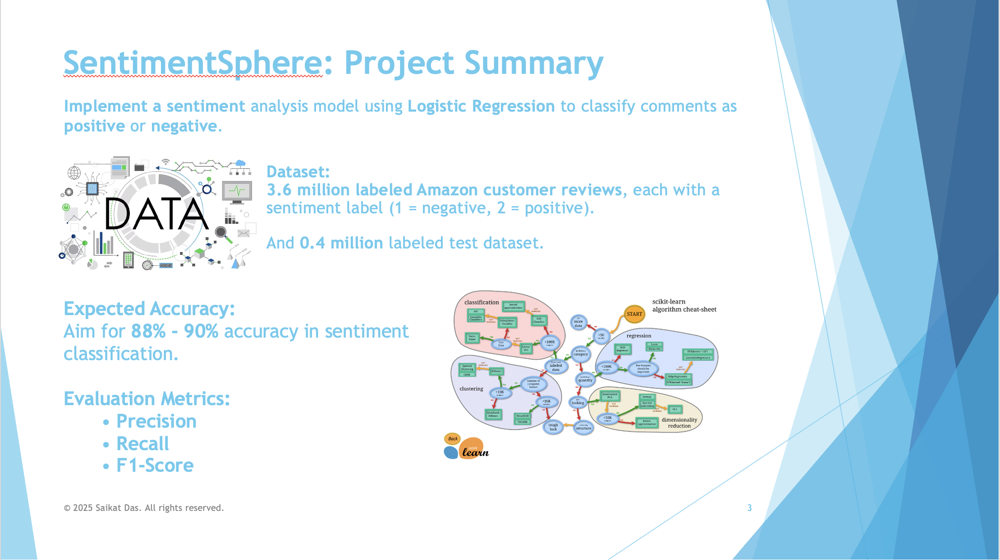
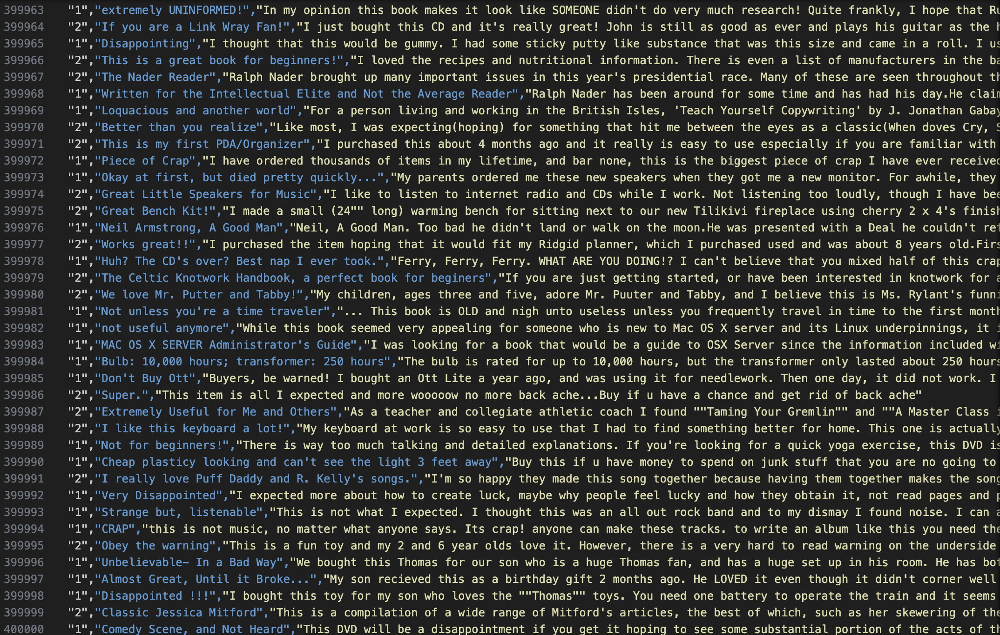
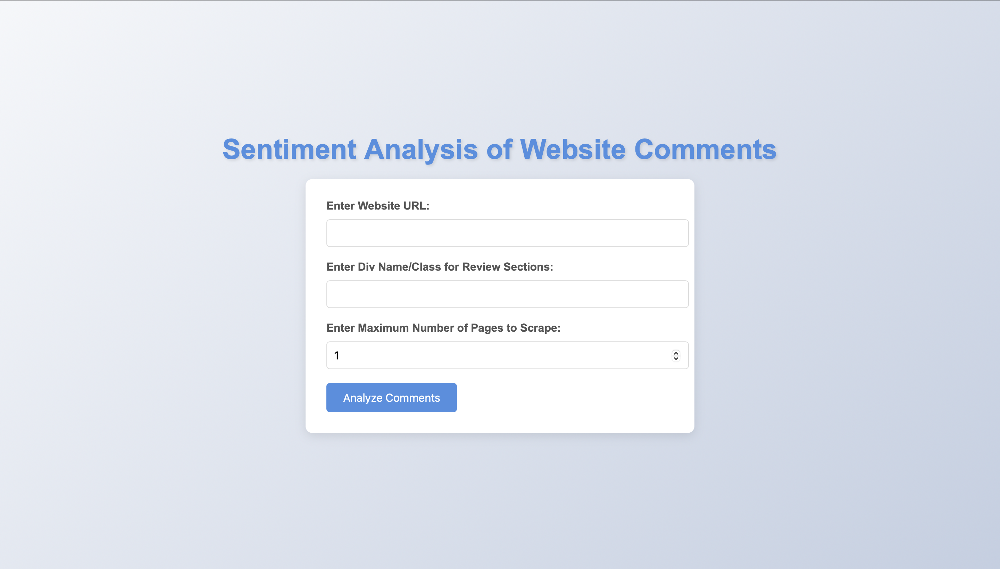
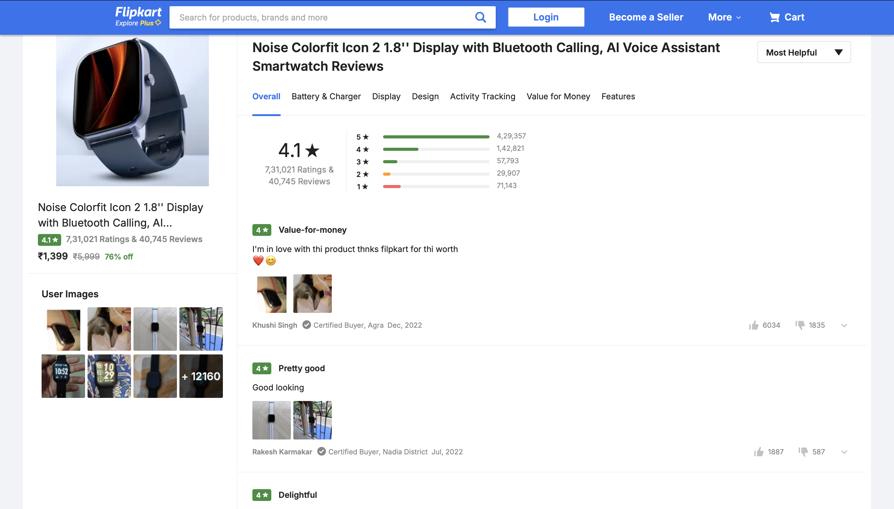
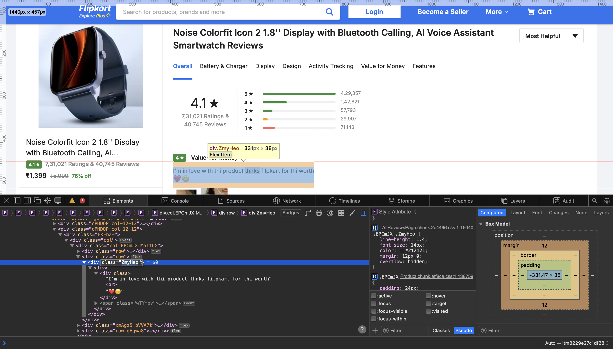
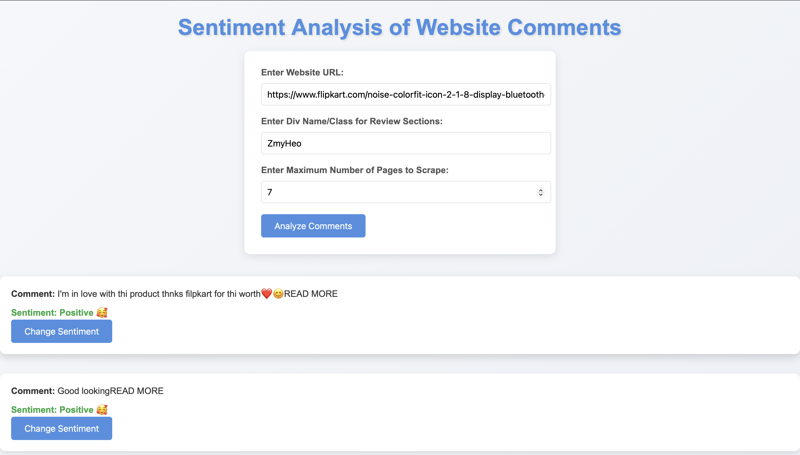
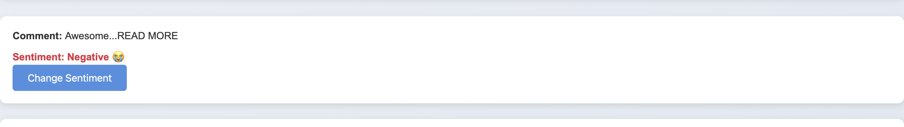
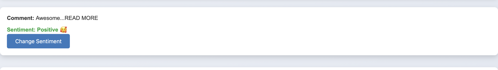
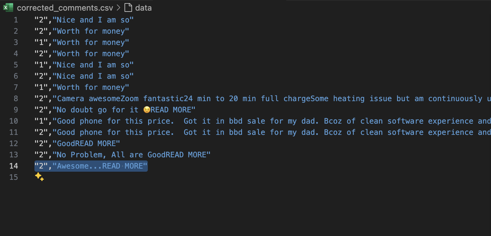

# 📦 SentimentSphere  
**Sentiment Classification of E-commerce Reviews Using Textual Data Analysis**  
_By Saikat Das, Dept. of CSE, AUST_


## 🔍 Project Overview  
SentimentSphere is a real-time sentiment classification system designed to analyze customer reviews from e-commerce platforms. Leveraging **Logistic Regression**, this project processes 3.6 million labeled comments to determine whether feedback is *positive* or *negative*—helping businesses decode the voice of the customer automatically.

The project also incorporates **web scraping** to extract live review data, preprocesses noisy text, and ensures continuous accuracy improvement with a dynamic error detection system.

---

## 🎯 Key Features  
- ✅ **Binary Sentiment Classification** (Positive / Negative)  
- 🤖 Built using **Logistic Regression** from scratch with `scikit-learn`  
- 🌐 **Web Scraping** with BeautifulSoup and Requests for real-time review collection  
- 🧹 **Text Preprocessing** (stopword removal, stemming, noise handling)  
- 🧠 **Model Evaluation** using accuracy, precision, recall, and F1-score  
- 🔄 **Dynamic Error Detection** & update mechanism for smarter results  
- 🧾 Simple UI/CLI for quick testing of user input sentiment  

---

## 🧠 Tech Stack  
| Tool | Purpose |
|------|---------|
| Python | Core programming language |
| Scikit-learn | ML model (Logistic Regression) |
| Numpy, Pandas | Data manipulation |
| BeautifulSoup, Requests | Web scraping |
| Matplotlib, Seaborn | Visualization |
| Jupyter Notebook | Prototyping & testing |

---

## 🛠️ Setup & Installation  
1. Clone the repository  
   ```bash
   git clone https://github.com/your-username/SentimentSphere.git
   cd SentimentSphere

[](https://youtu.be/vmguU8wUVBY?feature=shared)

## 📸 Screenshots & Visuals  

<table>
  <tr>
    <td></td>
    <td></td>
  </tr>
  <tr>
    <td></td>
    <td></td>
  </tr>
  <tr>
    <td></td>
    <td></td>
  </tr>
  <tr>
    <td></td>
    <td></td>
  </tr>
  <tr>
    <td></td>
    <td></td>
  </tr>
  <tr>
    <td></td>
    <td></td>
  </tr>
</table>